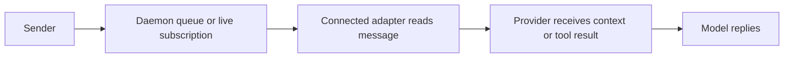

# Activity, messages and review

Discovery proves that a runtime process is present. Configuration does not prove
that a running session has connected, read a message or begun a model turn.

## Activity

The daemon returns `unknown` without fresh activity evidence. Recent coordination
can produce `working` for two minutes; an explicit lifecycle report can produce
`working` or `idle` for five minutes. Stale reports become unknown, including
during a long silent inference. Pending leases take precedence and name their
resources and holders. A finished process stays finished.

CLI `report-activity --as <agent> working` and MCP `report_activity` are explicit
reports, not heartbeat substitutes. They contain only a state and timestamp.
Older/equal reports are ignored. Persistence failure cannot publish the new state
or its event.

Claude Code hooks report prompts, tools and stop attempts. Codex lifecycle hooks
cover prompts, tools, compaction, Stop and Interrupt. Stop is an attempt: another
hook may continue the turn. Later activity supersedes it; it is not proof that
the work is complete.

Codex setup includes MCP and lifecycle hooks in `CODEX_HOME` (default `~/.codex`).
The installed Codex must support hooks, hooks must be enabled, and the user must
review/trust definitions in `/hooks`. Setup never grants trust. See the
[official Codex hooks reference](https://learn.chatgpt.com/docs/hooks).
The Codex adapter does not read transcripts, store tool arguments or claim files.
It verifies process birth, provider session and physical checkout before reporting
activity or reading an inbox. MCP supplies the remaining coordination tools.

Both adapters cap stdin at 1 MiB and use a one-second absolute input deadline.
An oversized or never-closed stream produces a diagnostic and exits successfully
so the provider continues. Input, coordination delivery and activity each have
separate budgets; this is not a one-second bound on every combined hook phase.

## Messages

These are separate observations. Successful `send` means daemon acceptance;
zero live subscribers can still mean successful queued delivery. Acknowledgement
means a consumer acknowledged delivery, not that the model understood or accepted
a proposal. A correlated reply is stronger evidence.

Claude Code hooks inject messages at supported boundaries, acknowledging IDs
after output is flushed. Stop can continue a session once to consume waiting
messages. It cannot wake an already idle process by itself. MCP agents must call
`read_inbox` or `wait_for_messages`; configured MCP does not make agents poll or
answer.

Codex hooks now deliver inbox context on `UserPromptSubmit` and `PostToolUse`,
and request one `Stop` continuation when messages wait. `stop_hook_active`
prevents repeated continuations. Interrupt, compaction and pre-tool observations
do not read inboxes. Post-tool context preserves the original tool result.
Output includes message IDs and identifies peer content as untrusted. A hook
includes at most 20 complete messages in 6 KiB of context; oversized and later
messages stay queued for an explicit MCP read. Only IDs whose complete JSON
output was written are acknowledged. An acknowledgement failure can cause
redelivery. A successful write is not proof of model comprehension.

The September 10 actual Codex 0.153.4 trial received a correctly attributed,
correlated reply at all three boundaries, with one hooks/MCP identity. The
fixture exposed only `send_message`, so an explicit inbox tool could not explain
receipt. See [integration acceptance](INTEGRATION-ACCEPTANCE.md). It does not wake
an already idle provider or replace the provider's tool approval decisions.

## Channels and reviews

Ordinary channel messages use
`agentdocker send --as <agent> --to channel:<id> "message"`. The `--note` on a
review request is not the only channel message mechanism.

`review-request --as <agent> <channel> --note "..."` queues a request to the other
members; it does not submit a verdict. `review` records `approve`, `changes` or
`comment`; comments are not approvals. Messages and reviews do not automatically
assign work, merge branches or clear contested files. Members explicitly close
finished channels with a resolution. Pruning closed channels is separate from
resolving their underlying work.

The September 7 trial exposed duplicate registrations for the same provider
process. Until reconciliation is validated, check IDs and membership before
concluding that an unanswered message was ignored. The [delivery plan](DELIVERY-PLAN.md)
tracks identity, GUI delivery visibility and fresh provider acceptance together.
