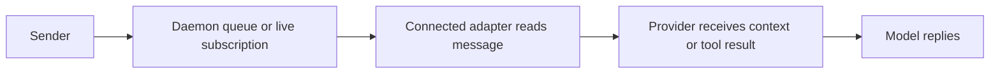

# Activity, messages and review

The September 10 [input-queue and idle-wake audit](MESSAGE-DELIVERY-AUDIT.md)
adds the requirement that peer messages use the same submitted-input workflow as
user messages and wake an idle provider. The lifecycle hooks described below do
not provide idle wake. The opt-in [managed Codex bridge](CODEX-INPUT.md)
(`--codex-input`) polls the queue while idle and starts a turn in its owned
app-server conversation; it does not attach to an existing Codex TUI. The enabled
[Claude channel adapter](CLAUDE-CHANNEL-INPUT.md) (`--claude-channel`) can also
deliver input while idle. Each guide records its source-specific acceptance limits.

Discovery proves that a runtime process is present. Configuration does not prove
that a running session has connected, read a message or begun a model turn.

## Activity

The daemon returns `unknown` without fresh activity evidence. Recent coordination
can produce `working` for two minutes; an explicit lifecycle report can produce
`working` or `idle` for five minutes. Stale reports become unknown, including
during a long silent inference. Pending leases take precedence and name their
resources and holders. A finished process stays finished.

CLI `report-activity --as <agent> working` and MCP `report_activity` are explicit
reports, not heartbeat substitutes. They contain only a state and timestamp.
Older/equal reports are ignored. Persistence failure cannot publish the new state
or its event.

Claude Code hooks report prompts, tools and stop attempts. Codex lifecycle hooks
cover prompts, tools, compaction, Stop and Interrupt. Stop is an attempt: another
hook may continue the turn. Later activity supersedes it; it is not proof that
the work is complete.

Codex setup includes MCP and lifecycle hooks in `CODEX_HOME` (default `~/.codex`).
The installed Codex must support hooks, hooks must be enabled, and the user must
review/trust definitions in `/hooks`. Setup never grants trust. See the
[official Codex hooks reference](https://learn.chatgpt.com/docs/hooks).
The Codex adapter does not read transcripts, store tool arguments or claim files.
It verifies process birth, provider session and physical checkout before reporting
activity or reading an inbox. MCP supplies the remaining coordination tools.

Both adapters cap stdin at 1 MiB and use a one-second absolute input deadline.
An oversized or never-closed stream produces a diagnostic and exits successfully
so the provider continues. Input, coordination delivery and activity each have
separate budgets; this is not a one-second bound on every combined hook phase.

## Messages delivered by lifecycle hooks

These are separate observations. Successful `send` means daemon acceptance;
zero live subscribers can still mean successful queued delivery. Acknowledgement
means a consumer acknowledged delivery, not that the model understood or accepted
a proposal. A correlated reply is stronger evidence.

Claude Code hooks inject messages at supported boundaries, acknowledging IDs
after output is flushed. Stop can continue a session once to consume waiting
messages. It cannot wake an already idle process by itself. MCP agents must call
`read_inbox` or `wait_for_messages`; configured MCP does not make agents poll or
answer.

Codex `SessionStart` verifies the session and starts a supported native receiver
without claiming turn activity. Other Codex hooks deliver inbox context on `UserPromptSubmit` and `PostToolUse`,
and request one `Stop` continuation when messages wait. `stop_hook_active`
prevents repeated continuations. Interrupt, compaction and pre-tool observations
do not read inboxes. Post-tool context preserves the original tool result.
Output includes message IDs and identifies peer content as untrusted. A hook
includes at most 20 complete messages in 6 KiB of context; oversized and later
messages stay queued for an explicit MCP read. Only IDs whose complete JSON
output was written are acknowledged. An acknowledgement failure can cause
redelivery. A successful write is not proof of model comprehension.

The September 10 actual Codex 0.153.4 trial received a correctly attributed,
correlated reply at all three boundaries, with one hooks/MCP identity. The
fixture exposed only `send_message`, so an explicit inbox tool could not explain
receipt. See [integration acceptance](INTEGRATION-ACCEPTANCE.md). This historical
hook path does not wake an already idle provider; the separate managed bridge
described above supplies that behavior for its owned conversation. Neither path
replaces the provider's tool approval decisions.

### One consumer for an externally registered session

A session that registered itself through hooks or MCP has no single consumer:
whichever hook or explicit read takes the queue delivers. An **input binding**
(`bind_input`, see the [protocol table](ARCHITECTURE.md#protocol)) gives such a
session one: an external controller process, bound to the exact provider
generation (the registered pid and birth, the registered `session_id`, an
absolute profile path) and identified by a token the controller made and
keeps (a coordination identifier between processes of one OS user, not a
security boundary). While the binding stands, every legacy read, draining or not, is answered
`input_owned` instead of messages (a person or the app looks with
`peek_input`, which records nothing), the controller's `provider_inbox` reads
(with the token) take the queue as `input_batch`, and its `report_input` is
the only readiness and receipt evidence accepted. A controller that restarts
resumes the binding with its token; another provider generation waits for an
explicit `unbind_input`. Messages a hook had already been offered before the
binding travel flagged as `uncertain`, so the controller reconciles them
against the provider before enqueueing anything, and a hook finishing that
in-flight delivery may still acknowledge exactly those.

A controller that ends leaves an idle provider with no hook to start it again,
so a bind may carry a **launch descriptor**: the exact command the controller
was started with. The daemon then watches the bound controller by pid and
birth; when it is gone it says so (`input_controller_ended`), pauses the
agent's delivery evidence, and starts the descriptor again with backoff (0, 2,
4, 8, 16 seconds; five launches per episode, then `input_restarts_exhausted`;
a controller that stayed bound for a minute starts the count over), while the
provider process is still running. After the daemon gave up, `agentdocker
provider retry <agent>` or the selected session's **Retry receiver** action in
the desktop app starts the episode over on the same binding, queue and
provider; nothing in the inbox controls repairs a receiver. The started process binds itself with the
same token: the daemon restarts receivers, never provider sessions, and never
rebinds or changes the provider generation on its own. The descriptor is kept
on the agent record in the open, so the token belongs in a private file, not
in its arguments or environment. The daemon side is in source; the Codex
native-queue controller that uses it is separate work.

## Channels and reviews

Ordinary channel messages use
`agentdocker send --from <agent> --to channel:<id> "message"`. The `--note` on a
review request is not the only channel message mechanism.

`review-request --as <agent> <channel> --note "..."` queues a request to the other
members; it does not submit a verdict. `review` records `approve`, `changes` or
`comment`; comments are not approvals. Messages and reviews do not automatically
assign work, merge branches or clear contested files. Members explicitly close
finished channels with a resolution. Pruning closed channels is separate from
resolving their underlying work.

The September 7 trial exposed duplicate registrations for the same provider
process. Until reconciliation is validated, check IDs and membership before
concluding that an unanswered message was ignored. The [delivery plan](DELIVERY-PLAN.md)
tracks identity, GUI delivery visibility and fresh provider acceptance together.
