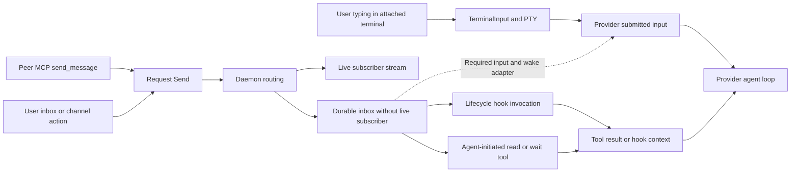

# Agent input queues and idle wake audit

Added September 10, 2026 at the user's request. This is a top-priority requirement
in the [active delivery plan](DELIVERY-PLAN.md) and [remaining work](REMAINING-WORK.md).
It tracks partial implementation and the acceptance still needed for each provider.

## Required behavior

An agent-to-agent message must enter the same provider input workflow and queue
as a message the user submits. An idle connected agent must be notified and begin
a turn without waiting for the user to type something or for another hook/tool
event. A busy agent must receive the message according to that provider's normal
queued-input behavior. Messages must retain their sender, destination, message ID
and reply relationship through the entire path.

The same scheduling path must preserve peer attribution and provider permission
rules. Peer text must not become system/developer instructions. Delivery must not
steal focus, submit another person's unfinished draft, or type into an unrelated
terminal. Repeated pings must not create duplicate turns or unbounded reply loops.

## Current evidence and gap

The opt-in [Claude channel adapter](CLAUDE-CHANNEL-INPUT.md) now has
[actual-provider evidence](verification/2026-09-11-claude-channel-input.json)
at `c9677ab`: idle wake without prompt input; queued peer/user messages and a
terminal prompt during a blocked tool; explicit ordered receipts and correlated
replies; and an unsubmitted terminal draft preserved through a second idle wake.
Claude 2.1.268 processed four fixture messages. Six release-transport cases also
cover pressure, reconnect and broken/unread output. Actual model recovery around
ambiguous acceptance, managed launch, durable UI receipt state and sustained
conversations remain. A profile guard detected three global Claude usage-counter
changes during concurrent sessions; the full failure and narrower investigation
are retained rather than reporting an unchanged profile.

The following lifecycle-only gap still applies to Codex and ordinary hook/MCP
configurations without the enabled Claude channel adapter.

The daemon has inbox queues and live subscriptions. A successful send establishes
routing/queue acceptance, not provider input acceptance or model consumption.
Claude and Codex hooks can inject queued messages at supported lifecycle
boundaries. The actual Codex trial proves prompt/tool/Stop context consumption
and correlated replies for its tested version. Neither hook adapter, by itself,
wakes a provider that is already idle. MCP configuration alone does not cause an
agent to poll, and a waiting inbox tool is a separate delivery path that must be
audited rather than assumed equivalent to normal submitted input.

Current acknowledgements after hook output establish adapter output, not a
receipt from the provider's input queue. This requirement therefore remains open
despite the passing lifecycle-hook tests.

## Audit and implementation sequence

| Order | Work | Reviewable result |
| --- | --- | --- |
| 1 | Trace user submission and peer delivery separately for Claude Code and Codex: desktop terminal input, native provider input, CLI/MCP sends, channels, daemon inbox/live routing, hooks, reads and acknowledgements. | Source-linked sequence diagrams showing exactly where paths join or diverge; runtime/version and managed/external/desktop-host differences. |
| 2 | Inspect each provider's supported submitted-input and wake mechanisms, including what happens when busy, idle, disconnected, awaiting approval or exiting. | Capability matrix backed by local code and official provider interfaces; reproduce the current idle-delivery gap with owned fixtures. Unsupported routes stay explicit. |
| 3 | Design one per-agent submitted-input adapter using the provider's normal input queue. Connect the durable AgentDocker outbox to that adapter and wake an idle connected provider. | Reviewed state machine and prototype demonstrating an idle turn from a peer message, with no user input or incidental hook needed. Do not treat a desktop notification as a provider wake. |
| 4 | Define ordering, admission/backpressure, expiry/cancellation, retries, deduplication and receipts across daemon and provider queues. Preserve queued work through reconnect/restart and identity reconciliation. | Protocol/events/storage/CLI/MCP/GUI changes together. No silent eviction of accepted work; uncertain provider acceptance is visible rather than blindly replayed. |
| 5 | Make delivery state understandable. Distinguish queued locally, accepted by the provider, processing, and failed/expired where evidence supports each state. | Compact UI status and actionable failures. No “delivered” or “read” claim based only on enqueue, subscriber count, hook stdout or a ping. |
| 6 | Exercise actual Claude and Codex conversations, including the user's authorized live Claude peer when available. | Sanitized exact-source results with message IDs, queue transitions, correlated model replies and fixture cleanup; raw prompts/configuration stay private. |

Audit any separate handling of human questions/answers and channel messages as
well as direct peer messages. A bridge must target the canonical session, not a
launcher process or a duplicate transport record. Full Windows and desktop-host
adapters need their own input/wake acceptance; a successful Unix terminal trial
does not establish their behavior.

## Acceptance cases

- **Idle:** send a fresh nonce to an agent waiting for input. Without typing,
  polling from a test prompt or triggering a hook, it starts a turn and returns
  a correlated reply through its normal provider input path.
- **Busy:** send several peer messages while a long turn/tool is running. Verify
  provider queue order and turn boundaries against equivalent manually submitted
  messages; preserve the running operation and outstanding approval state.
- **Mixed input:** interleave user and peer submissions. Verify the documented
  ordering, sender attribution and message IDs, with no starvation or lost draft.
- **Retry/reconnect:** retry the same ID, lose the delivery connection around
  provider acceptance, reconnect MCP/hooks and restart the daemon. Assert no
  lost accepted work or duplicate turns; ambiguous acceptance must remain visible.
- **Unavailable recipient:** disconnected, exited, unsupported and PID-reused
  recipients must not receive invented wake/delivery success or another session's
  message. Reconnection follows the documented expiry/retry policy.
- **Queue pressure:** test bounded queues, slow consumers, message size limits,
  cancellation and expiry. Surface backpressure without silently dropping an
  accepted message.
- **Channels and replies:** fanout wakes only intended members; reply IDs and
  question routes remain correct after reconnect and canonical-identity lookup.
- **Sustained conversations:** alternate and concurrently send between actual
  Claude and Codex sessions, repeatedly entering idle. Measure enqueue-to-provider
  acceptance and acceptance-to-first-turn latency separately; check loop bounds,
  queue/resource growth and cleanup.

This audit and the implemented queue/wake acceptance are required before marking
incoming-message delivery complete. The existing hook bridge and successful
round trips are supporting evidence, not completion of this requirement.

## Initial source audit

Read-only tracing against code checkpoint `bf39280` confirms distinct paths:

The dotted adapter is planned. Human channel/inbox actions already share daemon
messaging with peers; typing into the attached provider terminal uses a different
path. The new requirement reaches the provider's submitted-input queue.

| Finding | Evidence | Consequence for implementation |
| --- | --- | --- |
| Terminal typing and peer messaging diverge | [`TerminalInput`](../crates/ui/src/app/shell.rs#L504) calls the terminal transport; [`ChannelSend`](../crates/ui/src/app.rs#L1155) and [`send_message`](../crates/cli/src/mcp.rs#L480) issue daemon envelopes. | A provider input adapter must join these workflows; adding a notification alone cannot do it. |
| Fixed in source: live subscribers bypassed durable inbox insertion | [`publish_question`](../crates/agentd/src/daemon.rs#L4316) persists only recipients without live subscribers, then broadcasts. [`subscribe`](../crates/agentd/src/daemon.rs#L2853) drains the backlog when opening a subscription. | Audit disconnect/slow-subscriber windows. A live stream is not a durable provider-acceptance receipt. |
| Fixed in source: inbox overflow discarded old messages | The daemon limit is 1,000; [`insert_inbox`](../crates/agentd/src/store.rs#L779) keeps the newest entries and memory drops the oldest. | The required submitted-work queue needs explicit backpressure/retention semantics; current bounded inbox behavior can evict previously accepted messages. |
| MCP receipt boundary added | `read_inbox` now defaults to retaining messages and `wait_for_messages` always retains them. The model acknowledges its received IDs with `acknowledge_messages`; explicit `drain: true` remains destructive. | The standard gate passed 704 Rust tests and 48 Python checks. Actual MCP process death, broken output, reconnect and selective receipt trials passed, plus 110 native desktop workflow steps. Actual-provider acknowledgement remains pending for this follow-up. Receipt does not establish task completion or idle wake. |
| Hook output is not an idle input submission | [`Codex delivery`](../crates/cli/src/hooks/codex.rs#L232) prepares lifecycle context and acknowledges after output. | Retain existing evidence, but add actual idle-start and provider-queue receipts before claiming parity. |

The first two loss paths now have a schema-10 correction: all addressed recipients retain accepted messages during live streaming, subscription startup does not acknowledge the backlog, and count/byte pressure rejects the entire fanout before publication. Explicit acknowledgement alone frees space. Focused regressions exercise mixed human/peer ordering, reconnect/restart replay, full broadcasts, byte pressure and failed writes. The full standard gate passed 701 Rust tests (six skipped), 48 Python checks, lint, package and release builds. The immutable schema-10 daemon passed actual reconnect/crash, over-limit schema-9 upgrade, atomic broadcast and byte-pressure trials; a separate three-crash trial preserved pending questions and refused downgrade without changing database/WAL bytes. The table preserves the original audit evidence; provider receipt/idle-wake integration remains open. No live user's inbox was drained to investigate these defects.

## Provider interfaces to prototype

Codex's documented app-server interface accepts submitted input with `turn/start`
and active-turn input with `turn/steer`; steering requires the expected active turn
ID. The installed Codex 0.153.4 schema generator confirms these methods and an
optional `clientUserMessageId`. That field's presence alone does not prove retry
idempotency. Audit busy behavior and ownership of the existing thread before
choosing an adapter. This is a supported integration candidate, not evidence that
arbitrary discovered CLI sessions are remotely controllable.
[Official app-server reference](https://learn.chatgpt.com/docs/app-server).

Claude's Agent SDK documents persistent streaming input with sequential queued
messages and interruption support. The installed CLI advertises
`--input-format stream-json` and `--replay-user-messages` in print mode. This is a
candidate for sessions whose input stream AgentDocker owns; taking over an
already running external terminal session remains unproven.
[Official streaming-input reference](https://code.claude.com/docs/en/agent-sdk/streaming-vs-single-mode).

Only help/schema inspection and documentation reads were used for these leads.
No provider daemon was started or attached, no message was submitted, and no user
provider configuration was changed by this inspection.

### Claude Code channels (September 10 follow-up)

Installed Claude Code 2.1.267 and the official channels reference provide another
candidate: declare `capabilities.experimental["claude/channel"] = {}` during MCP
initialization, then emit `notifications/claude/channel` with `{content, meta}`.
Metadata values are strings; keys use letters, digits and underscores. Claude
sets the source from the configured MCP server. Events queue in order; busy
sessions receive queued events together on a later turn. The session must enable
this server as a channel at startup. A bare local development server currently
uses the documented per-entry development opt-in and confirmation; enterprise
policy still applies. Existing sessions are not upgraded in place.

The provider gives **no transport acknowledgement of processing** and can silently
ignore events when the channel is not enabled. A successful write must therefore
retain uncertain delivery state until an explicit correlated receipt/reply. This
interface has been verified against documentation with the parallel Claude
session; production integration and busy/mixed-input trials remain open.
[Official channel contract](https://code.claude.com/docs/en/channels-reference).

An owned interactive Claude 2.1.267 fixture then passed the idle capability trial:
after its initial READY turn completed, one MCP channel event started another
turn, called the nonce receipt tool once after 2.675 seconds, and replied RECEIVED.
No further stdin was submitted before the receipt. The fixture completed the
documented local-development confirmation and logged channel registration; it
exited cleanly. Two preceding print/stream-json probes connected ordinary MCP
but produced no receipt within 40 seconds, including a retry pinned to protocol
2025-06-18. This is evidence for the interactive opt-in path, not automatic support
for every launch mode or a completed AgentDocker delivery implementation.
[Sanitized provider trial](verification/2026-09-10-claude-channel-probe.json).

The [schema-10 checkpoint](verification/2026-09-10-durable-queue.json) pins clean source `a9b54b5` and matching immutable binaries: 701 Rust tests, 48 Python checks, five actual queue scenarios, seven restart/upgrade checks, 105 native workflow steps and 23 notification-navigation steps passed. Provider input acceptance/idle wake and physical Notification Center clicks remain distinct open gates.

### September 10: visible-message receipts and checkout removal

[Checkpoint `796270a`](verification/2026-09-10-bulk-receipts.json) adds explicit batch dismissal of shown messages, retains unseen messages and drafts, removes duplicate pending-question presentation, exposes CLI receipt IDs, and ignores repeated/unknown receipt events. Removed temporary checkouts no longer masquerade as competing edits in the reproduced classifier and actual macOS watcher trials. The full gate passed 710 Rust tests and 48 Python checks; queue/MCP, 114 native control steps and 23 routing steps passed. The first GUI idle-sample exit remains unexplained, and high UI resource use remains under investigation. Supported provider idle-wake adapters are the next implementation task.

### September 11: opt-in Claude channel adapter

The [Claude input adapter](CLAUDE-CHANNEL-INPUT.md) now has source implementation: retained inbox offers over the provider channel, explicit receipts, stable IDs, initialization gating, a single-owner lock, hook delivery suppression and a receipt path independent of long-running tools. A real transport trial exposed blocked Tokio stdin during broken-output shutdown; bounded dedicated stdio workers address that failure. Compilation, the full gate, fresh transport runs and actual-provider acceptance must be tied to the final source before closing any input/wake requirement. This does not complete Codex input delivery or managed launch integration.
