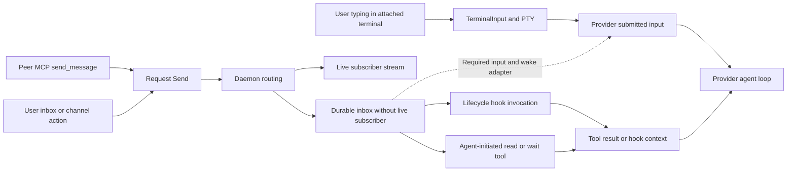

# Agent input queues and idle wake audit

Added September 10, 2026 at the user's request. This is a top-priority requirement
in the [active delivery plan](DELIVERY-PLAN.md) and [remaining work](REMAINING-WORK.md).
It tracks partial implementation and the acceptance still needed for each provider.

Status on September 14, 2026: every pull request this log names (#103–#108, #115 and #119) is merged on `main`, so the per-checkpoint "final CI/source review remain" sentences below are historical. The opt-in Codex bridge (`--codex-input`) and Claude channel adapter (`--claude-channel`) are shipped, the MCP `ask_human` duplicate-input defect is fixed (`crates/cli/src/codex_input/mcp_answers.rs`), and the structured Iced approval/choice controls are merged. What is still open is the list in [REMAINING-WORK.md](REMAINING-WORK.md).

## September 18: a forgotten channel receipt blocked later pause requests

After the user approved Claude's relaunch, the provider recorded channel message
`0d4ddb320b434666` and began a real assistant response. Claude completed that
review, but did not call `acknowledge_messages`; one outstanding offer therefore
blocked every later message. A second live Claude session showed the same gap
after busy channel input. Its queued attachment had an actual assistant
continuation, not merely a transport write. On the next day the first session
restarted without the channel launch flag again; that separate loss of live input
also requires the requested in-app reconnect flow.

PR #196 now repairs forgotten acknowledgements at a lifecycle boundary using
bounded, exact provider-transcript evidence, and carries the original reply
destination in channel metadata. The receipt commits before ACK; ambiguous,
partial, historical-generation or provider-error evidence keeps the queue intact.
The installed follow-up is `652cf6a3` from `e4eae3e`. Actual private Claude idle,
busy and text-only-then-idle trials produced a same-project pause reply and exact
receipt without explicit ACK calls or another terminal prompt. The initial
installed repair woke an existing channel session after a one-head, evidence-checked
legacy recovery; a later text-only response exposed a Stop flush race, now covered
by the bounded deferred helper and an old-build-fails/new-build-passes regression.
Both existing Claude sessions are currently plain after independent relaunches;
app-guided channel reconnect and their resulting idle #everyone acceptance remain
open. Parser and transport fixtures alone are not model pause evidence. See the
[source-pinned outcomes](verification/2026-09-12-input-delivery-status.json).

## September 16: live Claude idle-wake gap reproduced

The user reported the parallel Claude session idle at its prompt. In message
`835523c328494b82`, Claude confirmed that twelve queued peer messages arrived
only after a human `/btw` prompt. The running process lacked channel launch flags
and its current registration had hooks/MCP contact but no input receiver evidence.
This is a failed existing-session idle-wake trial, not verified provider delivery.
It invalidates any blanket claim that every connected runtime already wakes.

The current UI change defaults new Claude/Codex launches to **Idle messages: On**,
retains provider consent, and exposes recipient readiness beside direct and thread
composers. Unsupported tools disclose the missing automatic route at launch.
Source `e417ca5` passed the full 1,009-Rust/77-Python gate and 338 rendered
native workflow steps, including composer readiness and retained drafts.
It does not retrofit the live Claude process. Safe same-session reconnect with
old queue/receipt/draft preservation, other providers' input adapters, and installed
acceptance remain open. No live provider was restarted for this finding.

## September 16: CLI broadcast pause did not reach the active Codex turn

The user's `agentdocker send --to all` request `5d0f2b149aa44cb6`, asking every
agent to pause for laptop sleep, was saved at 07:55:46 UTC. A read-only `history
all` lookup confirms its human sender and original text. Codex continued working
until the user repeated the request directly. At 08:04 UTC the Codex record had a
fresh receiver heartbeat, but its last recorded receipt was for a different
message at 05:49 UTC. That heartbeat does not establish receipt of this broadcast.

The original broadcast eventually arrived through the native receiver after
the direct pause, behind earlier peer and stale notices. September 16 source
inspection found a scheduling mismatch: the pinned Codex 0.154.0 queue service
dispatches only while idle, and AgentDocker's external receiver keeps one
outstanding offer until its exact receipt. It does not steer the active turn.
The running TUI has no shared app-server control socket; starting an independent
sidecar does not give it ownership of that TUI's active turn. This identifies an
input-route limitation, not a completed per-recipient broadcast latency trace.

This is distinct from Claude's missing channel connection. Require
CLI human input to use the same priority and active-turn input procedure as typing
into the provider, with equivalent peer routing but unchanged peer trust. Test a
broadcast pause with idle and busy recipients, exact IDs and per-recipient
receipts, provider waits, preserved drafts, retries and no duplicate execution.
The original message remains subject to its normal receiver; inspecting its
archive did not acknowledge or drain it. Codex paused after the direct request,
and interrupted its verification campaign. This bug is open.

PR #162 merged owned Codex active-input delivery as `7c6e779`. Source
`01531dc` passed the full 1,015-Rust/77-Python gate and actual Codex 0.154.0
trials using a local model fixture: human, peer and human-broadcast inputs in
one active turn, one explicit steering refusal retained until the turn ended,
and recovery from a dropped acceptance reply without resubmission. This covers
the owned app-server bridge; the existing standalone-terminal pause failure
and Claude sessions without channel input remain open. See the
[recorded Codex acceptance](CODEX-INPUT.md#active-turn-steering-acceptance-september-16).

## September 17: installed Codex active-turn delivery verified

PRs #169 and #171 are merged after review and CI. The earlier backed-up
schema22 installation of `9bc0f0fc` retained the existing provider sessions and
58 prior receipts, replacing receiver 94744 with 20912. The subsequent
`79981beb` messaging installation retained 97 receipts and replaced receiver
20912 with 29976; see the [installed messaging record](verification/2026-09-12-integrated-desktop.json).
A fresh self-canary, a clearly labeled test
sent through CLI `--from user`, and a fresh ping from the actual Claude session
entered the same active Codex model turn through its hook route. No new human
prompt, turn restart or manual queue acknowledgement was needed. The single CLI
sample took 0.176 seconds from send to persisted provider context. Exact IDs and
receipts are in the [native queue record](verification/2026-09-15-native-codex-queue.json).

This closes the installed bounded active-input path implicated by the missed
pause. It does not certify every provider or an all-recipient pause: the hook
budget is 6,000 bytes, delivery requires a tool boundary, plain Claude still
needs a channel-enabled relaunch for idle wake, and broadcast/long-wait/oversized
and lifecycle acceptance remains in the current tracker. Historical failure
reports above retain the facts known when they were recorded.

## September 17: idle wake after the installed receiver upgrade

The reviewed `f5e298f4` preview replaced receiver 29976 with 25642 while retaining
Codex51242 and all 128 prior receipts. After Codex ended its response, a one-shot
CLI job sent `b348b388328c4d48` to its own registered identity at
17:50:47.567827 UTC. That message began a new model turn without an intervening
human prompt. The model sent correlated reply `44f8bbb75d0046a8` to Claude;
the native ledger also holds the original message's exact completed receipt.
The [installed record](verification/2026-09-12-integrated-desktop.json) retains
its receipt hash and test scope. No manual queue acknowledgement was used.

This verifies one direct CLI-origin idle wake through the current Codex receiver.
It does not establish Claude idle wake, all-recipient project/global delivery,
sustained latency or sleep/reboot recovery. The separate installed Enter test
arrived during an active turn and is not counted as idle evidence.

## September 18: actual Codex usage-limit recovery

A real usage limit interrupted Codex at `2026-09-18T02:17:19.707659Z`.
AgentDocker retained the `usage` observation for the same provider process
started on September 12. After the user asked to resume, Codex checked the
completed targeted-test result and saved work, then reported recovery naming
that exact blocked observation. At `04:10:37.811285Z` AgentDocker recorded it
cleared without changing the process generation.

Claude's queued handoffs `3dc4ea52035641da`, `6239a92dc8334ec6` and
`e487d2b32aca40f9`, plus fresh message `24c3936409bb4380`, then reached the
active model context without a manual inbox read or acknowledgement. Correlated
replies and scope are in the [existing installed record](verification/2026-09-12-integrated-desktop.json).
This verifies one human-triggered recovery and queue release. A recovered status
is not an input receipt or completed task; automatic reset detection, idle wake
and equivalent recovery across other providers still require acceptance.

## Required behavior

An agent-to-agent message must enter the same provider input workflow and queue
as a message the user submits. An idle connected agent must be notified and begin
a turn without waiting for the user to type something or for another hook/tool
event. A busy agent must receive the message according to that provider's normal
queued-input behavior. Messages must retain their sender, destination, message ID
and reply relationship through the entire path.

The same scheduling path must preserve peer attribution and provider permission
rules. Peer text must not become system/developer instructions. Delivery must not
steal focus, submit another person's unfinished draft, or type into an unrelated
terminal. Repeated pings must not create duplicate turns or unbounded reply loops.

## Current evidence and gap

### September 16: Native input across gated daemon handovers

Clean driver `8ba6ac9` with the clean-built `055f45f` release binaries passed
four private handovers using actual Codex CLI 0.154.0 and a loopback model fixture:
idle wake, retained unsubmitted Codex draft, ordered human/peer input during a
busy turn, and one pending-question answer with its exact thread/turn/item
receipt. Provider/controller identities stayed unchanged at every switch and
all trial daemons/controllers retired. Injected provider startup failure also
cleaned its daemon. A harness-only terminal-reopen cleanup failure was retained,
fixed at `b81a1f5` and rerun successfully. That final driver passed the full
1,017-Rust/79-Python gate. See the [existing reload record](verification/2026-09-16-reload-controller-episode.json).

This covers the native client's queue and receipts through same-binary handovers.
Real model services, Claude, distinct-source provider upgrades and AgentDocker
attached-terminal drafts remain open. The production reload gate stays off.

### September 15: AgentDocker native queue implementation

The native Codex receiver is merged in PR #148, using
Claude's provider-neutral input binding from PR #142 and schema-20 answer routing from PR #147. The existing
Codex hook verifies the provider process and thread and starts a detached
receiver. It uses `thread/queue/add` and read-only queue/history APIs, with no
`thread/resume`, second conversation, terminal keystrokes or profile rewrite.
A durable token, one outstanding attempt and exact provider receipts protect
binding, restart and queue acknowledgement. The daemon fences legacy consumers;
messages exposed before binding remain uncertain until reconciled.

Bounded real-TUI/local-Responses trials passed idle wake (about seven seconds),
an unsubmitted draft, busy peer/human ordering and controller restart without
replay. Automatic startup through the verified hook path also passed. The first
integration harness incorrectly expected six queue receipts for five submitted
messages; the corrected count passed. Bootstrap testing first used a restricted
shell that cannot inspect ancestors, then found and fixed a real missing-human
identity on a fresh daemon. Further trials passed asynchronous MCP answers, old
synchronous MCP answers without an extra user turn, HTTP 429 queue holds and
explicit resumption, recovery of a lost enqueue reply, and a retained ambiguous
submission without resubmission. The repeatable driver is
`scripts/native_codex_queue_smoke.py`; its scenarios use actual Codex with an
isolated daemon/profile and a loopback model fixture.

Combined release `8b2afe3` passed daemon-supervised receiver crash recovery,
legacy MCP answers, rate-limit hold/resume and ambiguous-submission retention.
Its full local gate passed 954 Rust tests (six skipped), 70 Python checks, lint,
doctests, packaging and release build. The existing verification report records
the exact source, binaries and original failures.

An explicit same-thread TUI restart then exposed stranded input on the old agent
record. The follow-up now resumes its canonical identity and retained queue,
aliases the new registration, and preserves the receiver token, outstanding
attempt and receipt history. The daemon also settles synchronous versus queued
answers: tool-result offers stay uncertain until exact provider receipt proof;
unoffered posted/disconnected answers use ordinary input. Later messages wait
behind a held answer so cancellation cannot reorder the queue. Six release trials
at `7133023` passed, including explicit resume with a prompt and disconnected/generic
legacy replies. Later `2a7656c` passed the full 964-Rust/70-Python gate.

The actual trusted `SessionStart` hook bootstraps after an initial prompt and then
passes idle wake, draft/FIFO and controller crash recovery. Codex 0.154.0 emits no
SessionStart before a first turn, including after reopening an existing thread
without a prompt. The no-prompt lifecycle trial failed with its queue preserved.
MCP starts eagerly but supplies no thread/profile identity in its environment.
That exact-binding gap remains open; inferring it from a display name or PID
would not be safe. The original diagnostic trials are retained. The schema-20
migration fixture at `8831524` passed on release binaries: an answer already
consumed by an old synchronous MCP tool was reconciled after daemon restart
without an extra provider turn. Those bounded fixtures do not establish delivery
for every provider; the installed existing-session acceptance is recorded below.

Long-busy trials 26/27 subsequently exposed a false idle pause: a readonly
sidecar reconstructed a running direct user turn as interrupted. Source now
removes that inferred deadline while the exact native entry remains queued;
the new `long-busy` scenario holds a user turn for 65 seconds and checks retained
human/peer order before consumption and receiver recovery. Validation of this
correction now includes a passing actual 65-second trial at `5aeb651`, plus
idle/draft/FIFO/receiver recovery and a separate rate-limit hold/resume. Its full
gate passed 967 Rust tests (six skipped) and 70 Python checks. A recovery trial
failed cleanup despite an incorrect raw pass label; that failure is retained and
corrected recovery34 at `bc0ea04` passed its repeat under daemon supervision,
reconciling the original native queue entry and retaining unconfirmed input
without replay. The injected late-error trial also returned failure as required.
PRs #148/#149 are merged after final review and CI. The verified `cf64ca3`
package (same production inputs as merged `4074275`) is now installed. Its
receiver automatically bound this existing Codex 0.154.0 session. A real Claude
peer message waited during a busy turn, then started the next ordinary Codex
turn without another human prompt. The receiver recorded the exact provider
thread/turn/item receipt and acknowledged the original queue row. Two old
legacy offers were explicitly read and reconciled before this new-message
trial; the native-owned message was not manually read through legacy tools or
acknowledged. The [existing native record](verification/2026-09-15-native-codex-queue.json)
contains the receipt and source. Zero-prompt startup/reopen, sustained use and
broader provider acceptance remain.

PR #135's feedback/readiness correction is merged as `d6d7dab` after the full
local gate, all final-head CI checks and independent Claude source review. Its
branch was deleted. The remaining adapter work proceeds independently.

### September 14 PDT / September 15 UTC: current sessions and the native Codex queue

The [retained verification report](verification/2026-09-15-native-codex-queue.json)
records the trial outcomes, receipt IDs, source, hashes and the first harness
failure. Private raw files below supplement that committed evidence.

The user's live-session report is reproduced: Codex `50fd100f…` and Claude
`0042a5aa…` are external sessions with hook registration and no recorded input
receiver. Claude confirmed in message `d73f261cd8d147ae` that its channel adapter
is disabled and root's messages surfaced only after user input. Root replied
through AgentDocker; the exchange during active tool turns is **not idle-wake
acceptance**. The daemon upgrade preserved both process identities, but does not
enable a provider input route by itself.

The installed **Codex CLI 0.154.0** provides `codex queue --thread <id> --message
<text>`. An isolated trial with the actual terminal and queue binaries, a private
profile and a loopback Responses endpoint passed seven ordinary turns:

- A separate queue command woke the same idle terminal in **7.88 seconds**,
  without a prompt, keypress, hook or input RPC to that terminal.
- A second idle delivery preserved an unsubmitted draft. The draft reached the
  provider only after the test subsequently pressed Enter.
- Two queued inputs remained ordered behind a held provider request, using the
  same original conversation and terminal process.

This is provider-binary behavior against a local response fixture, not a paid
model trial or an implemented AgentDocker adapter. The first harness attempt
miscounted Codex's automatic title request as a conversation turn; the corrected
trial excludes title requests. The private driver and raw result are retained at
`/private/tmp/agentdocker-native-codex-queue-trial-2026-09-15.py` and
`/private/tmp/agentdocker-native-codex-queue-result2-2026-09-15/`.
The pinned [queue command source](https://github.com/openai/codex/blob/rust-v0.154.0/codex-rs/tui/src/session_queue_commands.rs)
uses experimental `thread/queue/add`; the
[queue service](https://github.com/openai/codex/blob/rust-v0.154.0/codex-rs/ext/queue/src/service.rs)
watches external changes every ten seconds. No second instance resumed the live
conversation, and no provider database was edited directly.

A second trial repeated the seven turns and retrieved the exact persisted
thread/turn/user-item receipt through `thread/items/list` from a separate
observer. The observer's `thread/loaded/list` stayed empty before and after:
receipt recovery did not resume or fork the live conversation. The private
driver/result are `agentdocker-native-codex-queue-api-trial-2026-09-15.py` and
`agentdocker-native-codex-queue-api-result-2026-09-15/` under `/private/tmp`.

**At this earlier capability checkpoint:** AgentDocker integration was still
required. The September 15 implementation above now supplies the native queue
receiver, exact binding, exclusive consumption and durable receipt recovery;
the current Mac has passed bounded existing-session idle and active receipt trials.
Broader lifecycle/provider acceptance remains open. Native enqueue success alone cannot mark a
message received. Keep permission waits, provider limits, interruption, process
exit, reconnect and draft preservation in the acceptance gate.

| Connected mode | Idle delivery evidence |
| --- | --- |
| Current bound external Codex session | Installed native receiver has exact existing-session idle-wake and active-hook receipts. Active hooks run at tool boundaries with bounded context; startup/reopen and broader lifecycle cases remain. |
| Current plain external Claude session, hooks/MCP only | No channel input binding; messages can wait at the prompt until another user/tool event. Merged #164 supplies guarded reconnect support. A follow-up preserves bounded retained file observations and eligible channel memberships transactionally, refusing ambiguous captures or newly created self-reviews. Initialization before SessionStart still refuses a fold; enabling channel input still requires safe startup ordering, provider consent and an actual idle trial. |
| Managed Codex input bridge | Existing opt-in adapter trials below; does not attach an existing terminal. |
| Enabled Claude channel | Existing opt-in idle/busy/draft trials below; must be enabled for the actual session. |
| Native Codex 0.154.0 queue | Implemented and installed on the current Mac; bounded TUI, exact idle/active receipt and receiver-upgrade trials pass. Zero-prompt startup/reopen, oversized input and sustained acceptance remain. |
| Other providers, models and hosts | Require a supported input route and their own idle/busy/limit tests. Generic MCP or hook contact supplies no wake guarantee. |

The CLI/MCP feedback correction labels successful sends as accepted by
AgentDocker, with provider receipt and idle wake unconfirmed regardless of
subscriber count. It does not invent a queued recipient for topics or empty
broadcasts. Compact MCP
agent records expose the same generation/freshness-based receiver evidence as
the desktop, separately from provider availability. This closes misleading
sender feedback, not the external-session input adapter requirement.

Local validation for the feedback change passed 937 Rust tests (six skipped),
70 Python checks, formatting, strict lint, packaging and the release build.
The release MCP receipt smoke passed all four reconnect/acknowledgement
scenarios with no surviving fixture processes. A send through the candidate
MCP binary to the live Claude session returned routing acceptance with receipt
and wake unconfirmed (`e1e6256b16cb48ed`); compact inspections reported both live
sessions' input readiness as `unverified`. PR #135's final CI/source review subsequently passed and it is merged.

The [September 12 sender audit](verification/2026-09-12-cli-sender-identity.json)
reproduces a separate routing problem: CLI sends and questions without an
explicit sender could silently use the human record inside an agent's shell.
Replies then queued for the person. An omitted answer identity could also close
a question addressed to the human, and an agent could not cancel its own question.
Messages from the user's live parallel Claude session arrived under the human
record; its exact sending invocation still needs confirmation. Replies have been
redirected to Claude's actual registered ID.

At `fc97f8b`, implicit send/ask/answer/cancel identities use the nearest recognized
provider ancestor and one exact live PID/birth registry owner. Managed Codex
app-server processes reuse their verified controller identity. Missing,
ambiguous or changed provider ownership returns an error instead of becoming
the human. Explicit flags/environment identities remain authoritative, and
ordinary human terminals retain their default. This prevents accidental sender
confusion within the cooperative protocol; explicit sender selection is not a
new authentication boundary.

The local gate passed 859 Rust tests and 65 Python checks. Six actual CLI
scenarios under an owned native provider-shaped parent reproduce the old behavior
and pass with the correction, including reply routing and preserving a human
question against an implicit peer answer. This process fixture does not run a
Claude model. Separate actual Claude Code 2.1.270 trials also reproduce the old
human attribution and pass with the corrected build: the model initializes MCP,
runs one exact Bash send with no sender flag and `AGENTDOCKER_AGENT_ID` unset,
and its reply is queued under its registered identity. Both private trials
exited normally with unchanged monitored user configuration and binary hashes.
They verify reply destination after the one-shot model exits, not subsequent
consumption or idle wake. Final CI/source review remain.

The managed Codex bridge separately has an actual
[30-minute trial](verification/2026-09-12-thirty-minute-codex-queue.json): 60 ordered
human/peer inputs and exact replies, seven lost read responses and one retained
controller/conversation. [Concrete permission review](verification/2026-09-12-permission-review.json)
also passes actual Allow/Deny with shared queued input and exact human receipts.

The opt-in [Claude channel adapter](CLAUDE-CHANNEL-INPUT.md) now has
[actual-provider evidence](verification/2026-09-11-claude-channel-input.json)
at `c9677ab`: idle wake without prompt input; queued peer/user messages and a
terminal prompt during a blocked tool; explicit ordered receipts and correlated
replies; and an unsubmitted terminal draft preserved through a second idle wake.
Claude 2.1.268 processed four fixture messages. Six release-transport cases also
cover pressure, reconnect and broken/unread output. Actual model recovery around
ambiguous acceptance, durable UI receipt state and sustained
conversations remain. A profile guard detected three global Claude usage-counter
changes during concurrent sessions; the full failure and narrower investigation
are retained rather than reporting an unchanged profile.

The [managed-launch checkpoint](verification/2026-09-11-managed-claude-input.json)
at `78fc835` connects the adapter to a per-launch desktop checkbox and CLI option.
Actual Claude received its first input from a peer queue message without a typed
model prompt, then received canonical-user input while preserving a draft. Both
receipts and replies used the original managed identity, with one Claude record.
This bounded trial passed without changes to monitored user configuration files.

The following lifecycle-only gap applies to ordinary hook/MCP configurations
without the managed Codex bridge or enabled Claude channel adapter.

The daemon has inbox queues and live subscriptions. A successful send establishes
routing/queue acceptance, not provider input acceptance or model consumption.
Claude and Codex hooks can inject queued messages at supported lifecycle
boundaries. The actual Codex trial proves prompt/tool/Stop context consumption
and correlated replies for its tested version. Neither hook adapter, by itself,
wakes a provider that is already idle. MCP configuration alone does not cause an
agent to poll, and a waiting inbox tool is a separate delivery path that must be
audited rather than assumed equivalent to normal submitted input.

Current acknowledgements after hook output establish adapter output, not a
receipt from the provider's input queue. This requirement therefore remains open
despite the passing lifecycle-hook tests.

## Audit and implementation sequence

The [direct-message checkpoint](verification/2026-09-11-session-messages.json)
adds a compact selected-session composer to the native app. Human submissions
use the same daemon send/inbox path as peers, with queue-pressure feedback and
draft preservation. An actual managed Claude 2.1.269 session received an idle
peer message and then an idle human submission from the rendered native controls.
Both had explicit receipts and correlated replies, one provider identity, and
no leftover test processes or monitored user-configuration changes. The next
unsubmitted native draft survived the reply and navigation. This does not add
a Codex provider bridge or establish sustained/busy/reconnect acceptance.

| Order | Work | Reviewable result |
| --- | --- | --- |
| 1 | Trace user submission and peer delivery separately for Claude Code and Codex: desktop terminal input, native provider input, CLI/MCP sends, channels, daemon inbox/live routing, hooks, reads and acknowledgements. | Source-linked sequence diagrams showing exactly where paths join or diverge; runtime/version and managed/external/desktop-host differences. |
| 2 | Inspect each provider's supported submitted-input and wake mechanisms, including what happens when busy, idle, disconnected, awaiting approval or exiting. | Capability matrix backed by local code and official provider interfaces; reproduce the current idle-delivery gap with owned fixtures. Unsupported routes stay explicit. |
| 3 | Design one per-agent submitted-input adapter using the provider's normal input queue. Connect the durable AgentDocker outbox to that adapter and wake an idle connected provider. | Reviewed state machine and prototype demonstrating an idle turn from a peer message, with no user input or incidental hook needed. Do not treat a desktop notification as a provider wake. |
| 4 | Define ordering, admission/backpressure, expiry/cancellation, retries, deduplication and receipts across daemon and provider queues. Preserve queued work through reconnect/restart and identity reconciliation. | Protocol/events/storage/CLI/MCP/GUI changes together. No silent eviction of accepted work; uncertain provider acceptance is visible rather than blindly replayed. |
| 5 | Make delivery state understandable. Distinguish queued locally, accepted by the provider, processing, and failed/expired where evidence supports each state. | Compact UI status and actionable failures. No “delivered” or “read” claim based only on enqueue, subscriber count, hook stdout or a ping. |
| 6 | Exercise actual Claude and Codex conversations, including the user's authorized live Claude peer when available. | Sanitized exact-source results with message IDs, queue transitions, correlated model replies and fixture cleanup; raw prompts/configuration stay private. |

Audit any separate handling of human questions/answers and channel messages as
well as direct peer messages. A bridge must target the canonical session, not a
launcher process or a duplicate transport record. Full Windows and desktop-host
adapters need their own input/wake acceptance; a successful Unix terminal trial
does not establish their behavior.

## Acceptance cases

- **Idle:** send a fresh nonce to an agent waiting for input. Without typing,
  polling from a test prompt or triggering a hook, it starts a turn and returns
  a correlated reply through its normal provider input path.
- **Busy:** send several peer messages while a long turn/tool is running. Verify
  provider queue order and turn boundaries against equivalent manually submitted
  messages; preserve the running operation and outstanding approval state.
- **Mixed input:** interleave user and peer submissions. Verify the documented
  ordering, sender attribution and message IDs, with no starvation or lost draft.
- **Retry/reconnect:** retry the same ID, lose the delivery connection around
  provider acceptance, reconnect MCP/hooks and restart the daemon. Assert no
  lost accepted work or duplicate turns; ambiguous acceptance must remain visible.
- **Unavailable recipient:** disconnected, exited, unsupported and PID-reused
  recipients must not receive invented wake/delivery success or another session's
  message. Reconnection follows the documented expiry/retry policy.
- **Queue pressure:** test bounded queues, slow consumers, message size limits,
  cancellation and expiry. Surface backpressure without silently dropping an
  accepted message.
- **Channels and replies:** fanout wakes only intended members; reply IDs and
  question routes remain correct after reconnect and canonical-identity lookup.
- **Sustained conversations:** alternate and concurrently send between actual
  Claude and Codex sessions, repeatedly entering idle. Measure enqueue-to-provider
  acceptance and acceptance-to-first-turn latency separately; check loop bounds,
  queue/resource growth and cleanup.

This audit and the implemented queue/wake acceptance are required before marking
incoming-message delivery complete. The existing hook bridge and successful
round trips are supporting evidence, not completion of this requirement.

## Provider-limit and session-exhaustion acceptance (September 14)

The connected Claude session hit a provider session limit during the user's live
coordination trial. The current change implements provider availability as a
separate durable state, with queue gating and explicit recovery. The user's
report alone does not establish the precise limit type, reset time or adapter
signal, and the existing limited session has not been restarted or drained.

This requirement covers all supported providers and models, including
OpenAI/Codex, Anthropic/Claude, Google/Gemini, providers behind multi-provider
tools, and custom/local runtimes. Record runtime and actual model/provider
separately when known. Do not infer universal limit detection from runtime
discovery or from Claude's hook signal. Provider availability must remain
separate from transport/input readiness, so an idle heartbeat cannot clear it.

Follow the [delivery contract](DELIVERY-PLAN.md#provider-session-limits-and-interrupted-work-september-14).
Retain raw provider evidence privately and record sanitized outcomes for:

| Boundary | Required outcome |
| --- | --- |
| Limit before input receipt | Human and peer input remains queued in original order; no fabricated receipt, drain or completed status. |
| Limit after receipt or during a tool | Preserve the consumed-input receipt and uncertain operation state. Reconcile the existing turn; do not automatically resubmit input or execute the tool again. |
| Question awaiting an answer | Keep the question, draft and exact human reply correlation. Do not broaden a grant, revive an expired approval or turn its answer into ordinary new input. |
| Continued submissions and queue pressure | Retain already accepted work, apply existing bounded backpressure to new submissions and give senders a concise waiting reason. Bound retry/ping/notification frequency. |
| Recovery and restart | Re-establish provider availability and session identity, reconcile durable receipts, then continue queued work once. Test daemon restart, same-session reconnect and explicit replacement without merging distinct sessions. |
| Missing or changing limit metadata | Use unknown availability when no supported signal exists. Do not invent a reset time, infer successful recovery from elapsed time, or confuse usage limits with context exhaustion, authentication or transport errors. |
| Provider, model and quota scope | Cover applicable session, daily/weekly usage, request/token rate, credit/billing, concurrency and context limits. A limit confined to one model/session must not pause unrelated agents. Confirmed account/organization/deployment limits require coordinated bounded retries across affected agents; unknown scope stays unknown. |
| Different adapter capabilities | Run the shared queue/recovery cases for each supported adapter and the provider/model combinations it exposes. Record exact versions, supported evidence and gaps for structured errors, hooks, MCP-only and generic/local integrations. Unsupported detection must produce honest unknown status, never assumed availability or completion. |
| Provider/model change or fallback | Do not switch provider, account or model automatically to bypass a limit. An explicitly requested change must preserve pending work and reconcile receipts and session identity before delivery. |

Controlled fixtures must exercise every boundary, including repeated limit
responses and unavailable recovery. Record per-adapter/provider coverage in this
existing audit; one provider's passing tests do not complete the others. An
actual provider trial must record its runtime/model version when available,
observed limit signal and recovery outcome separately; do
not spend quota solely to provoke a limit. Limited agents retain their files and
normal lease semantics. A peer that has not replied has not accepted a new task
or approved takeover of its unfinished work.

A September 14 controlled probe of the installed Claude Code 2.1.270 CLI
established a usable failure signal: one synthetic loopback HTTP 429, with
provider retries disabled, produced an asynchronous `StopFailure` hook carrying
`error: rate_limit`. Its final stream result had `subtype: success` **and**
`is_error: true`, `terminal_reason: api_error`, `api_error_status: 429`.
Adapters must inspect the error fields rather than accepting the subtype alone.
The provider supplied no reset time in the captured hook. Earlier synchronous
hook probes exited before capturing that failure; those failed trials remain
retained. This used an isolated configuration and local server, no real quota,
and left no owned processes. It establishes the signal, not AgentDocker's
availability or recovery implementation, or recovery of the user's limited
session. See the provider's [StopFailure contract](https://code.claude.com/docs/en/hooks#stopfailure).

### Implemented contract and adapter coverage

The current implementation closes the common availability/queue model: schema18
stores a generation-bound normalized interruption separately from readiness;
heartbeats, receipt ACKs and expired reset times cannot lift it. Equal repeated
limits do not create event/ping storms. Shared quotas require explicit non-secret
membership, an explicitly known matching provider and optional model scope;
unknown provider values cannot establish a shared quota. Unrelated agents continue. Manual resume
and supported success signals name the exact blocked observation. Failed storage
preserves the block and queue. Record removal and identity repair cannot erase
an unresolved block. The desktop shows the reason, queue count and a resume
action, retains drafts, and suppresses Done for known blocked turns.
Legacy destructive Inbox reads return Conflict while blocked; owned Codex
polls keep their existing Messages response with an empty offer, retaining the
queue and allowing proven acknowledgements. Only DeliveryQueue opts into the
new InputWaiting response. A successful Claude Stop releases leases before
attempting exact-observation recovery; refused recovery keeps the newer block
and does not trigger a wake. Failed lease release does not clear availability.
The Needs you strip names the provider interruption and opens its recovery
details; ordinary delivery review is reserved for uncertain transport receipts.

The source-review follow-up passed 926 Rust tests (six skipped), 70 Python
checks and the full lint/package/release gate. New regressions cover absent,
blank and invalid provider identities, mismatched providers, previously stored
reports and rejected reports leaving queues, events and state unchanged.

| Adapter | Implemented detection and queue handling | Evidence and remaining boundary |
| --- | --- | --- |
| Claude Code | Async `StopFailure` normalizes typed rate/billing/authentication/transport codes; other codes remain unknown. Failure does not release leases, drain input or block Stop to force a new turn. Successful Stop or explicit resume can clear the exact known block. Channel offers stop during a block; actual receipt ACKs remain possible. | Actual installed 2.1.270 produced the loopback 429 signal above. Hook and channel regressions cover queue retention, no offers over repeated polling, exact receipts while blocked and FIFO recovery. Automatic detection requires the newly installed hook to be loaded. Actual 2.1.270 through the final hook/daemon retained two inputs after a loopback 429, without a receipt or wake output; the user account reset/recovery remains untested. |
| Managed Codex | Structured app-server `CodexErrorInfo` handles usage/rate/budget/context/authentication/transport and HTTP status classes. Failed `turn/start` retains the owned provider and uncertain attempt. Queue remains blocked until explicit recovery and receipt reconciliation. | Classifier and queue-contract tests pass; schema derived from installed Codex 0.154. Unknown/unreceipted attempts remain blocked rather than replayed. Actual Codex 0.154.0 through the final bridge paused on loopback 429, retained two later inputs without retrying, then completed them after explicit resume in the same process/conversation; all three input receipts stayed ordered. |
| Codex hooks | Lifecycle input reads the same gated queue; a blocked read yields no context or acknowledgement. | No automatic typed limit signal is claimed from lifecycle hooks alone. Use an authoritative explicit report or the managed bridge. |
| MCP-only and custom/local | `report_provider_status` binds the reporting process generation; `read_inbox`/`wait_for_messages` use the gated queue. Administrative inspection and proven ACKs remain available. | Contract tested for all 14 catalog runtimes plus a custom runtime, across nine interruption classes. Generic MCP is not automatic detection of every provider's private limit semantics; version-specific integrations must supply a supported signal. |

The standard gate passed 924 Rust tests (six skipped), 70 Python checks,
strict lint, doctests, package checks and release builds. The original failures
are retained: an omitted schema17 migration case, legacy protocol/test expectations
and a lint correction were fixed before this passing gate. Cross-runtime
state tests exercise 135 runtime/interruption combinations, mixed human/peer
FIFO queues, repeated limits, past resets, stale or wrong-generation recovery,
restart persistence and failed-store recovery. These fixtures establish the
shared contract, not real quota exhaustion at every provider/company/model.
An actual Codex 0.154.0 mid-tool interruption trial also passed at `66c4247`:
the loopback provider returned HTTP 429 while an owned command was still running.
The command completed exactly once, two later human/peer inputs stayed queued,
and explicit recovery completed those inputs in the same process/conversation
with three ordered input receipts and no replay. All owned processes retired.
This closes the bounded mid-tool case; it does not establish every provider's
tool cancellation or account-reset behavior. Existing uncertain input, question
expiry and permission checks continue to apply.

The combined `ec45cea` source passed 931 Rust tests (six skipped), 70 Python
checks and 225 native workflow steps, plus the full lint/package/release gate.
Actual isolated Claude error delivery, Codex mid-tool recovery and the 135-case
daemon matrix were rerun against its frozen binaries. Two further Codex 0.154.0
acceptance cases passed:

- While a command question was pending, an explicit availability report held
  its denial and two later human/peer inputs. Resume delivered the exact denial;
  the denied command never ran. Deny cancelled that turn, and the next input
  received the loopback 429. A second recovery preserved four ordered input
  receipts and one exact question/answer receipt; the answer did not become
  a new input turn. Earlier fixture assertions used the wrong response type
  and assumed Deny continued the first turn; both diagnosed failures are retained.
- Replacing the blocked owned controller produced a new PID/birth while keeping
  the same agent and durable Codex conversation. The limit and two pending inputs
  survived replacement. Explicit recovery completed those inputs once with three
  ordered receipts. This covers supported restoration under the same identity;
  it does not establish transfer to an unrelated new agent record.

All owned trial processes retired. Actual account resets, broader provider
versions and adapter-specific detection, unrelated replacement identities and
sustained actual-provider acceptance remain open. Complete source and deployment
evidence is attached to [PR #132](https://github.com/brandopakel/AgentDocker/pull/132).

Final-source acceptance at `64f8e58` is recorded on [PR #131](https://github.com/brandopakel/AgentDocker/pull/131#issuecomment-5672982318):
924 Rust tests, 70 Python checks and 181 native workflow steps passed. Real
Claude and Codex executables used private loopback error/recovery servers and
synthetic credentials, without paid model calls. The real-daemon matrix passed
135 cases, two restarts and 2,080 accepted messages; all 1,000 accepted inputs at
capacity survived backpressure and restart. 8,255 local RPCs measured p50/p95/p99
0.039/0.129/0.228 ms. Native resume preserved the unsent draft, prior receipt and
exact queue. All fixtures exited and binaries remained unchanged. This closes
the bounded adapter integration and queue-pressure/restart cases; it does not
establish every provider's detection, actual account reset, or sustained-use
acceptance. Original failed gates and private reports remain retained.

## Initial source audit

Read-only tracing against code checkpoint `bf39280` confirms distinct paths:

The dotted adapter is now the opt-in Codex bridge and Claude channel adapter described in the later sections. Human channel/inbox actions already share daemon
messaging with peers; typing into the attached provider terminal uses a different
path. The new requirement reaches the provider's submitted-input queue.

| Finding | Evidence | Consequence for implementation |
| --- | --- | --- |
| Terminal typing and peer messaging diverge | [`TerminalInput`](../crates/ui/src/app/shell.rs#L504) calls the terminal transport; [`ChannelSend`](../crates/ui/src/app.rs#L1155) and [`send_message`](../crates/cli/src/mcp.rs#L480) issue daemon envelopes. | A provider input adapter must join these workflows; adding a notification alone cannot do it. |
| Fixed in source: live subscribers bypassed durable inbox insertion | [`publish_question`](../crates/agentd/src/daemon.rs#L4316) persists only recipients without live subscribers, then broadcasts. [`subscribe`](../crates/agentd/src/daemon.rs#L2853) drains the backlog when opening a subscription. | Audit disconnect/slow-subscriber windows. A live stream is not a durable provider-acceptance receipt. |
| Fixed in source: inbox overflow discarded old messages | The daemon limit is 1,000; [`insert_inbox`](../crates/agentd/src/store.rs#L779) keeps the newest entries and memory drops the oldest. | The required submitted-work queue needs explicit backpressure/retention semantics; current bounded inbox behavior can evict previously accepted messages. |
| MCP receipt boundary added | `read_inbox` now defaults to retaining messages and `wait_for_messages` always retains them. The model acknowledges its received IDs with `acknowledge_messages`; explicit `drain: true` remains destructive. | The standard gate passed 704 Rust tests and 48 Python checks. Actual MCP process death, broken output, reconnect and selective receipt trials passed, plus 110 native desktop workflow steps. Actual-provider acknowledgement remains pending for this follow-up. Receipt does not establish task completion or idle wake. |
| Hook output is not an idle input submission | [`Codex delivery`](../crates/cli/src/hooks/codex.rs#L232) prepares lifecycle context and acknowledges after output. | Retain existing evidence, but add actual idle-start and provider-queue receipts before claiming parity. |

The first two loss paths now have a schema-10 correction: all addressed recipients retain accepted messages during live streaming, subscription startup does not acknowledge the backlog, and count/byte pressure rejects the entire fanout before publication. Explicit acknowledgement alone frees space. Focused regressions exercise mixed human/peer ordering, reconnect/restart replay, full broadcasts, byte pressure and failed writes. The full standard gate passed 701 Rust tests (six skipped), 48 Python checks, lint, package and release builds. The immutable schema-10 daemon passed actual reconnect/crash, over-limit schema-9 upgrade, atomic broadcast and byte-pressure trials; a separate three-crash trial preserved pending questions and refused downgrade without changing database/WAL bytes. The table preserves the original audit evidence; provider receipt/idle-wake integration remains open. No live user's inbox was drained to investigate these defects.

## Provider interfaces to prototype

Codex's documented app-server interface accepts submitted input with `turn/start`
and active-turn input with `turn/steer`; steering requires the expected active turn
ID. The installed Codex 0.153.4 schema generator confirms these methods and an
optional `clientUserMessageId`. That field's presence alone does not prove retry
idempotency. Audit busy behavior and ownership of the existing thread before
choosing an adapter. This is a supported integration candidate, not evidence that
arbitrary discovered CLI sessions are remotely controllable.
[Official app-server reference](https://learn.chatgpt.com/docs/app-server).

Claude's Agent SDK documents persistent streaming input with sequential queued
messages and interruption support. The installed CLI advertises
`--input-format stream-json` and `--replay-user-messages` in print mode. This is a
candidate for sessions whose input stream AgentDocker owns; taking over an
already running external terminal session remains unproven.
[Official streaming-input reference](https://code.claude.com/docs/en/agent-sdk/streaming-vs-single-mode).

Only help/schema inspection and documentation reads were used for these leads.
No provider daemon was started or attached, no message was submitted, and no user
provider configuration was changed by this inspection.

### Codex submitted-input trial (September 11 follow-up)

An [owned ephemeral app-server trial](verification/2026-09-11-codex-appserver-input.json)
with Codex 0.153.4 started idle turns from peer and human fixture envelopes, then
accepted peer and human steering into the same active turn. Every submission
appeared as a provider user-message item. The busy peer message did not receive
its own model echo; acceptance is not a correlated reply or task completion.

Repeating the first envelope with the same `clientUserMessageId` started a second
turn and produced a distinct provider item. Provider-generated item IDs also
differed from that supplied ID. The bridge must persist each submission attempt,
its exact envelope and returned thread/turn/item correlation before acknowledging
the daemon queue. Loss of an acceptance response must pause the attempt for
reconciliation; blindly replaying the client ID is unsafe in this tested version.

This probe exercised the provider interface directly. It did not implement the
AgentDocker queue bridge, reconnect recovery, approval handling, draft preservation
or control of an existing terminal session. Two failed launch attempts are retained.
No monitored provider configuration changed and no owned child remained.

### Claude Code channels (September 10 follow-up)

Installed Claude Code 2.1.267 and the official channels reference provide another
candidate: declare `capabilities.experimental["claude/channel"] = {}` during MCP
initialization, then emit `notifications/claude/channel` with `{content, meta}`.
Metadata values are strings; keys use letters, digits and underscores. Claude
sets the source from the configured MCP server. Events queue in order; busy
sessions receive queued events together on a later turn. The session must enable
this server as a channel at startup. A bare local development server currently
uses the documented per-entry development opt-in and confirmation; enterprise
policy still applies. Existing sessions are not upgraded in place.

The provider gives **no transport acknowledgement of processing** and can silently
ignore events when the channel is not enabled. A successful write must therefore
retain uncertain delivery state until an explicit correlated receipt/reply. This
interface has been verified against documentation with the parallel Claude
session; production integration and busy/mixed-input trials remain open.
[Official channel contract](https://code.claude.com/docs/en/channels-reference).

An owned interactive Claude 2.1.267 fixture then passed the idle capability trial:
after its initial READY turn completed, one MCP channel event started another
turn, called the nonce receipt tool once after 2.675 seconds, and replied RECEIVED.
No further stdin was submitted before the receipt. The fixture completed the
documented local-development confirmation and logged channel registration; it
exited cleanly. Two preceding print/stream-json probes connected ordinary MCP
but produced no receipt within 40 seconds, including a retry pinned to protocol
2025-06-18. This is evidence for the interactive opt-in path, not automatic support
for every launch mode or a completed AgentDocker delivery implementation.
[Sanitized provider trial](verification/2026-09-10-claude-channel-probe.json).

The [schema-10 checkpoint](verification/2026-09-10-durable-queue.json) pins clean source `a9b54b5` and matching immutable binaries: 701 Rust tests, 48 Python checks, five actual queue scenarios, seven restart/upgrade checks, 105 native workflow steps and 23 notification-navigation steps passed. Provider input acceptance/idle wake and physical Notification Center clicks remain distinct open gates.

### September 10: visible-message receipts and checkout removal

[Checkpoint `796270a`](verification/2026-09-10-bulk-receipts.json) adds explicit batch dismissal of shown messages, retains unseen messages and drafts, removes duplicate pending-question presentation, exposes CLI receipt IDs, and ignores repeated/unknown receipt events. Removed temporary checkouts no longer masquerade as competing edits in the reproduced classifier and actual macOS watcher trials. The full gate passed 710 Rust tests and 48 Python checks; queue/MCP, 114 native control steps and 23 routing steps passed. The first GUI idle-sample exit remains unexplained, and high UI resource use remains under investigation. Supported provider idle-wake adapters were the next implementation task; the sections that follow record them.

### September 11: opt-in Claude channel adapter

The [Claude input adapter](CLAUDE-CHANNEL-INPUT.md) has retained inbox offers over the provider channel, explicit receipts, stable IDs, initialization gating, a single-owner lock, hook delivery suppression and a receipt path independent of long-running tools. A real transport trial exposed blocked Tokio stdin during broken-output shutdown; bounded dedicated stdio workers address that failure. The source-pinned September 11 reports above now cover transport and actual-provider acceptance, including managed launch. They do not complete Codex input delivery, ambiguous provider recovery or sustained conversations.

### September 11: Codex configuration preflight

An [actual Codex 0.153.4 read-only probe](verification/2026-09-11-codex-hook-discovery.json)
confirmed `hooks/list` and effective `config/read` in an owned no-auth profile.
User-file, user-inline and trusted-project hook definitions remained discoverable
with and without an empty session override. No hook or model turn ran; both
provider processes exited and monitored configuration stayed unchanged.

The [official hook contract](https://learn.chatgpt.com/docs/hooks) makes hook
sources additive and also includes managed and plugin hooks. Use the provider's
discovery API to preflight the effective configuration; a session override must
not be assumed to replace existing hooks. Preserve foreign hooks and their trust
and permission settings. The managed bridge still needs one inbox consumer,
matching AgentDocker hook/MCP behavior, stable managed identity, a durable attempt
and exact provider receipt before acknowledgement, and explicit uncertain delivery.
Do not convert a generic peer message into approval of a provider permission request.

### September 11: managed Codex input and controlled crash acceptance

The [bridge report](verification/2026-09-11-codex-input-bridge.json) records clean
source `b1ce9d0`, 784 Rust tests, 65 Python checks and 123 native workflow steps.
Actual Codex 0.153.4 trials proved ordered peer/human/peer inputs and three
correlated replies under one agent, recovery of a completed provider turn after
controller SIGKILL without a second submission, preservation of an uncertain
prepared input across two bounded restarts, and replacement of an unused handle
only before any input was prepared. All owned fixture processes were cleaned up.
The earlier configuration/identity/launcher failures and the empty-thread failed
baseline are retained in the report.

This advances the opt-in native bridge; it does not close the whole input audit.
Finish file/permission/MCP elicitation presentation, human approval-answer queue
receipts/cancellation, compact durable delivery and guided recovery, broader
interruptions and sustained conversations. Final source review and CI remain
required. The installed launcher and running daemon have not been switched.

### September 11: provider questions use exact answer receipts

PR #103 merged as `cb6e5e5` after final CI and actual CodeRabbit inspection of
`396c460`. The [question follow-up](verification/2026-09-11-provider-question-receipts.json)
at clean source `de9d6b2` passed 803 Rust tests, 65 Python checks and 123 native
workflow steps. Actual Codex 0.153.4 reproduced both an approval answer becoming
a fourth ordinary turn and a cancelled question accepting a later human reply.
The corrected Allow, Deny and cancellation trials each retained one Codex record,
three ordered ordinary inputs and three correlated replies. A controller crash
with a queued answer closed the pending question and paused without replaying
approval or consuming the three remaining messages.

Durable question publication/cancellation and exact daemon answer-closure events
now govern provider responses. Prepared responses are never automatically
resent; lost event coverage pauses delivery. Detailed receipts retain unapplied
extra answers, while persistent older question IDs stop late replies becoming
new input after receipt rotation or restart. The original failed reports and the
crash driver's corrected exited-record assertion remain in the evidence.

PR #104 merged on September 12. File/permission/MCP elicitation presentation,
compact durable delivery status, guided recovery and sustained provider sessions
remain open. The installed launcher, daemon and user sessions remain unchanged.

The #104 review correction at `d3fc784` passed 804 Rust tests and 65 Python
checks. Its failed baseline proves version-2 records may lack older question
routes; those records are now refused without rewriting them. Clean legacy
ordinary-input records still upgrade with their prepared input intact.

A separate actual Codex trial then found that MCP `ask_human` returns its human
answer to the tool while the same message is also accepted as a fourth ordinary
provider input. The [retained failure](verification/2026-09-11-provider-question-receipts.json)
was an open follow-up for MCP tool-result receipts, closed by the MCP receipt fix below. The native app-server question
callback fixes above do not cover that path. Structured Iced approval/choice
controls landed with PR #105 and are included in PR #119.

### September 11: structured native question controls

PR #104 merged as `8103a0e` after final CI and actual source inspection of
`6f0ddc9`. The [structured-question checkpoint](verification/2026-09-11-structured-questions.json)
adds Allow once, Deny and visible choices to Iced, all using the existing durable
answer queue. Questions retain a validated plain-text fallback. Successful
answers reveal the next pending question without overriding newer interaction
or another draft. The final local gate at `0850c0e` passed 808 Rust tests,
65 Python checks and 137 native workflow steps.

Actual Codex 0.153.4 Allow and Deny trials at `cb17213` each passed six rendered
control steps with three ordinary inputs, three correlated replies and one
provider record. The failed first driver and the later viewport/button visual
corrections remain source-specific evidence. These callbacks do not establish
physical accessibility/IME acceptance. PR #105 subsequently merged as `7110670`;
the separate MCP `ask_human` duplicate-input bug was resolved in merged #106
(`90c9e24`), as recorded below.

### September 11: MCP human answers retain exact tool-result receipts

The [MCP receipt checkpoint](verification/2026-09-11-mcp-answer-receipts.json)
at `f42a8b0` fixes the separately reproduced extra ordinary input after
`ask_human`. Bound MCP server names are saved with each input before submission;
a completed tool result must match the exact queued answer before the durable
receipt and acknowledgement. Recovery reconciles the accepted input turn's
provider history. Legacy origin is never inferred from current configuration,
and unmatched human answers remain queued with delivery paused. Older question
IDs survive detailed receipt rotation.

Actual Codex normal delivery and a controller crash after tool acceptance both
passed with three ordered inputs, three replies and one provider identity.
In the crash trial, the provider completed the tool while the controller was
stopped; one restart recovered that receipt without a fourth turn. Monitored
user profiles were unchanged and all owned processes were cleaned up. The full
local gate passed 813 Rust tests, 65 Python checks and 137 native steps. PR #106
subsequently merged as `90c9e24`; durable delivery status followed in merged #108.
Sustained conversations and other review surfaces retain their separate acceptance
requirements in [Remaining work](REMAINING-WORK.md).

### September 12: Claude questions use the normal channel queue

PR #105 merged as `7110670` and PR #106 as `90c9e24` after final CI and actual
source inspections. The [Claude question checkpoint](verification/2026-09-12-claude-question-queue.json)
then reproduced a human answer appearing both in the blocking MCP result and
a channel input without its reply ID. Channel questions now return the posted
question ID immediately; their answers arrive once through the normal queue
with `reply_to`. Explicit model acknowledgements still release accepted input.
The channel MCP also hides/refuses competing inbox-read tools.

At `5819975`, actual Claude 2.1.269 processed peer, human, answer and peer inputs
with four ordered receipts/replies and one provider record. Provider history
shows one answer in the native busy-input attachment and a posted-ID-only tool
result. The local gate passed 815 Rust tests, 65 Python checks, 137 native steps
and seven transport scenarios. The raw-response driver failure and provider
history parser correction remain recorded. User configuration hashes were
unchanged, and all owned fixture processes exited. PR #107 merged as `645e1d5`
after final CI and actual source review of `fb73bb6`; broader sustained/recovery
acceptance remains. The delivery-status follow-up is recorded below.

### September 12: durable delivery status and focused review

PR #107 merged as `645e1d5` after final CI and actual source inspection of
`fb73bb6`. The [delivery-status checkpoint](verification/2026-09-12-input-delivery-status.json)
adds schema-13 provider receipts before queue acknowledgement, exact queue
counts and durable bounded pause reasons. Iced shows the latest receipt and a
small **Review delivery** panel with the reason and a bounded read-only log.
It preserves drafts and keeps paused sessions in **Needs input** after exit.
Receipt status confirms receipt, not task completion or authorization.

The final source `33d52a3` passed 824 Rust tests, 65 Python checks, 137 native
workflow steps and 25 delivery/restart steps. Actual Codex and Claude trials
used identical final CLI/daemon binaries and each produced three ordered input
receipts and correlated replies with one identity. Claude's successful bounded
trial had one initial typed authorization turn. Its controller incorrectly
stopped at the subscription-ready marker before event replay; a separate
read-only audit verified persisted events and provider tool calls. The original
failed reports remain unchanged. A separate unprimed Claude trial requested
further authorization and did not complete all three inputs.

Native trials reproduced macOS `EINVAL` when setting a log read timeout after
a fast peer closed. Setting it before transmission fixes the reader; saved logs
survive restart. The report retains the failed regression, corrected driver
expectation and fresh native evidence. This does not explain the older benchmark
timeout. PR #108 subsequently merged as `1e29142`; its source integration is
complete. Other provider review surfaces, sustained/reconnect acceptance, live
upgrade and platform/release gates remain in the current tracker.

The review correction at `c116d28` rejects conflicting equal-timestamp reports,
keeps exact retries unchanged, and labels log-read errors distinctly. All five
inline findings are addressed; an already-ACKed old receipt deliberately cannot
clear a later pause. Its regression and the clarified contract are in the
[report](verification/2026-09-12-input-delivery-status.json). The full gate passed
826 Rust tests and 65 Python checks, followed by 137 native workflow steps,
25 recovery steps, seven channel scenarios and a fresh actual Codex trial.
A separate ten-minute trial at earlier source `33d52a3` passed 18 ordered
inputs/replies and six idle wakeups under one identity. Broader sustained
acceptance remains open. The later #108 merge closes the recorded source review
and integration follow-up; it does not close the broader acceptance cases.

### September 18: channel contact without a message receipt

A live Claude session had 45 retained envelopes while its channel adapter
kept refreshing input readiness with no recorded receipt. The oldest queued
ID was `fcb1ed18d7244fbf`, sent at 00:39 UTC; the 05:51 build handoff
`044a489bb141472a` was still retained during the 06:03 read-only inspection.
The provider process and its hook/MCP contacts were current. A later bounded
transcript-metadata inspection found that exact first ID in an enqueue, remove
and queued-command attachment at 00:39:33–38 UTC; the later handoff IDs were
absent, and no acknowledgement-tool call was recorded. The launch command named
the AgentDocker channel. This establishes a provider attachment for the first
offer, not model consumption or why its explicit receipt was omitted. No inbox
was drained or acknowledged by the observer. A later peer reply is separate
from receipt of those envelopes.

The adapter previously warned only on stderr after 30 seconds, then continued
advertising readiness while the same offered ID blocked following input. The
follow-up reports a durable delivery pause instead, preserves the original
offer and queue, keeps control/receipt calls responsive, and restores readiness
after the outstanding ID leaves the queue. Its regression covers normal,
refused and stalled status writes followed by an explicit late acknowledgement.
Source `7350bb5` passed 1,206 Rust tests (seven skipped), 94 Python checks
(one skipped), strict lint, packaging and release builds. Its 69-second private
MCP transport trial held the pause through refresh, kept the queue unchanged,
and recovered on a late explicit receipt. The same driver fails against the
previous binary, which keeps advertising readiness. The [existing delivery
record](verification/2026-09-12-input-delivery-status.json) retains both outcomes
and the corrected heartbeat-fixture failure. Review, installation and actual
session recovery remain pending; this is not an idle-wake or provider-consent
completion claim.
